# SWMG + Malakor — Art Research

> **Status: REFERENCE ONLY.** These images are visual research for menu art /
> world mood direction. They do **not** ship in the game and are not ours.
> Every image is credited with source + page below. Never present anyone's
> art as our own.
>
> This doc covers the **UNDERLYING** half of the binding theme formula
> (Malakor + SWMG = world mood/lore; Tekken + Urban Reign = presentation).
> It complements (does not repeat):
> - `docs/MALAKOR.md` — owner's research on the Malakor creator
> - `docs/MALAKOR_LAYER.md` — the implemented in-engine atmosphere layer
> - `docs/MENU_ART_PIPELINE.md` — the menu art recipes/tooling
>
> Research date: 2026-10-06.

---

## 1. Shadow Wizard Money Gang (SWMG)

### 1a. Origins

- **December 2022** — Canadian producer **Louka Tessier**'s producer tag,
  used by **DJ Smokey** (with Tessier's permission), opens Joeyy's song
  **"Gout"** (music video released Dec 2, 2022). A deep voice intones:
  *"Shadow wizard money gang, we love casting spells. This song is sponsored
  by the shadow government."* — this is the full original line; all three
  clauses became catchphrases.
- **January 2023** — the tag goes viral on **TikTok** in lip-dub videos
  (early one by @dudegetoffmylawn, Dec 22 2022), often paired with a
  "masturbation is a form of witchcraft" clip.
- **May 2023** — a **fan-art trend erupts on Twitter**, explicitly modeled on
  **Wizardposting** (the sibling meme of wholesome wizard posting). Key
  milestones:
  - May 23, 2023 — Twitter/Newgrounds artist **jarlungus** posts the
    **original purple wizard with golden jewelry** (the canonical look).
  - Then **RE_Thinkin** expands it: green and yellow wizards join the gang.
  - June 2023 — viral GIFs of robed wizards doing dances proliferate.
- **Related lore-talk from the community** (Urban Dictionary / meme entries):
  "they serve the almighty being most commonly known as **The Swag Messiah**";
  they also want "nuclear bombs" legalized (absurdist catchphrase). Pure
  irony — no real organization exists.

### 1b. Visual language (from the fan art, verified against refs below)

**Palette**
- Dominant: **royal purple / violet robes** (the gang's "uniform" — one of
  the few cases where matching color IS the meme)
- **Void-black face/hood interior** — faces are buried in black; only **two
  tiny sparkling white eye glints** read in the dark (this is the SWMG
  signature)
- **Gold everywhere**: heavy layered chains, rings, pendants ($ signs,
  crosses, stars), grills, bracelets
- Accents: toxic green glow, occasional neon purple/cyan auras
- Backgrounds: pitch black, flat greys, or dark atmospheres

**Motifs**
- Hooded robed figure, always, with the void face + eye glints
- White gloves (common in the meme art — formal/ceremonial contrast)
- Jewelry stacking: chains over chains, signet rings, pendants
- $ symbols worked into sigils and pendants
- Dancing/posing energy — the meme is playful menace, not grimdark

**Composition**
- Front-facing portraits (character-select-energy backplates), or triptychs
  of multiple wizards standing side-by-side
- Figures point at / reach toward the viewer (direct address — perfect for
  a 4th-wall narrator)

**Typography**
- No settled house type; the meme lives in spoken tags and captions.
  Community usage favors bold graffiti/display lettering when text appears.

### 1c. How the aesthetic evolved (meme/culture branches)

- **Crypto/meme culture**: SWMG became shorthand for "unconventional power +
  money magic" — the wizard as avatar of arcane financial knowledge, hustle
  manifesting, operating outside conventional structures.
- **Gaming mods/culture**: Friday Night Funkin' mod **VS SWMG**
  ("Money Mage" song, Purple Wizard opponent); a fan push to revisit
  **Magicka 2** because of the meme; a SWMG nextbot in Rockit's Nextbots.
- **Cybersecurity jokes**: college teams naming themselves SWMG in
  competitions; threat actors ironically signing attacks with the name —
  proof the meme reads as "mischievous outsider," not "dark lord."
- **Connection to AshLane canon**: the Narrator's design (purple robe,
  void-black face, sparkly eye glints, gold chains — see below) is
  *exactly* the SWMG visual language. The meme validates the design: this
  look is already legible to a huge online audience as "mischievous
  money-wizard," not generic fantasy.

### 1d. What to use vs. avoid for the Narrator / menus

- ✅ Void-black hood face + tiny white sparkly eye glints (the signature)
- ✅ Purple robe (his canon robe) with gold trim
- ✅ Layered gold chains, pendants, rings — hip-hop jewelry energy, not
  costume jewelry
- ✅ Direct-address poses (pointing at viewer, hand gestures)
- ❌ Pointy wizard hats (the meme art itself sometimes uses them, but our
  canon says hoods; the hat reads "D&D" to our audience)
- ❌ Staffs, spell circles as literal D&D iconography (use them as mural/
  graffiti motifs only, never as the character's gear)
- ❌ The cartoon/chibi wizardposting variants (meme literacy only)

---

## 2. Malakor

### 2a. What "Malakor" is in AshLane canon

Per `docs/MALAKOR.md` (owner's research): **Malakor is @_malakor on TikTok** —
a creator with a massive following who builds **"Malakortok"**, a named
cinematic universe rendered in AI-generated 90s-CGI-style clips (spellbooks
carrying the world name, trap aesthetics × mystical wizard lore ×
absurdist shitposting). The owner reverse-engineered the pipeline as
Midjourney/Stable Diffusion base images → Luma/Kling/Runway image-to-video
slow pans. The take-away for AshLane is the **feel, not the fidelity**:
pitch black × neon purple/deep blue/toxic green, surrealist menace (glowing
eyes in dark, skulls, dark cathedrals, imposing figures staring at camera),
slow heavy pacing, culture built INTO the models (grill in a glowing sun's
mouth, gold chains on a skeleton wizard holding a styrofoam cup).

Owner corrections stand: **no low-poly/PS1 rendering** — take the
themes (palette, mood, mashup energy), render modern and high-fidelity.

### 2b. "Malakor" as a name-family (external research)

There is **no single canonical "Malakor"** in outside fiction. The name sits
in a dark-fantasy name family — all variants of "shadow-power ancient evil"
sounding roots (Mal-, -achor, -kor). Documented instances:

- **Melkor / Morgoth** (Tolkien's *The Silmarillion*) — the original Dark
  Lord, mightiest of the Ainur, corrupter of creation. The name-family
  ancestor: "mal" (evil) + imposing suffix.
- **Malachor V** (*Star Wars: Knights of the Old Republic II*) — a cracked,
  lightning-ravaged dark-side nexus planet, site of the Trayus Academy.
  Strongest visual parallel for AshLane's Hollows: a *place* corrupted by
  dark power, not a person.
- **"Ascension of Malachor"** (WebNovel) — a dark-child-sorcerer origin story
  (glowing eyes, shadow-summoning at age five). Typical of how the name is
  used: born-dark power figures.
- **Malachor Wolfsbane** (World Anvil / D&D) — half-orc paladin; the name
  gets used for redeemed/dark-flavored heroes too.
- **Malagor the Dark Omen** (Warhammer Beastmen) — winged dark-shaman
  harbinger figure. Same phonetic territory.
- **Malachor** (fan wikis) — generic "evil dark tyrant in a floor-length
  black robe, red eyes in dark purple haze" descriptions recur; the name
  consistently evokes: **tall robed figure, darkness, ancient power.**

**Art-direction conclusion**: treat "Malakor" as a *mood-word*, not a
character or IP. It names the AshLane underworld layer: hooded/imposing
figures, glowing eyes in darkness, purple-green occult glow on grounded
streets, slow menacing pacing. It pairs with SWMG (the same palette and
the hooded figure, minus the money-playfulness) — which is exactly why the
owner's formula puts them together as the underlying layer.

### 2c. Dark-street magical-underworld notes (for Hollows / night districts)

- The underworld should feel like a **corrupted place**, not a fantasy realm:
  the street itself carries the menace (glowing eyes in alleys, spell-circle
  murals on brick, neon totems) — grounded Urban Reign city first, occult
  layer second.
- **Surrealist threat > horror**: glowing eyes, skulls, cathedrals, figures
  staring at camera — menacing but stylized, never gore.
- **Slow pacing** in menu/backdrop motion: breathing glow (0.25–0.45 Hz per
  MALAKOR_LAYER.md), drifting fog, slow pans. No strobing, no fast cuts.
- **Cultural mashup**: street culture injected INTO imposing visuals
  (chains on a skeleton, grill murals, slang in spellbook tags) — this is
  what separates AshLane's underworld from generic dark fantasy.

---

## 3. Contact sheet

| # | Ref | What it shows | Source / credit | Thread | Use in AshLane |
|---|---|---|---|---|---|
| 1 | 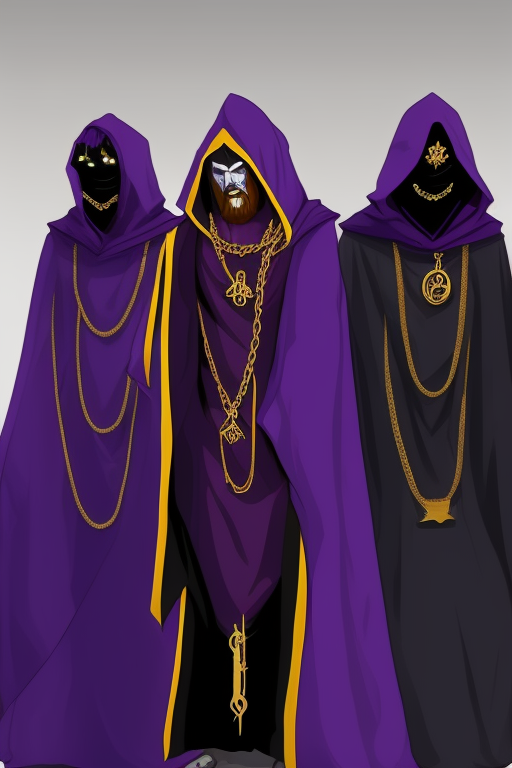 | Three robed wizards; purple robes w/ gold trim, void-black faces w/ eye glints, layered gold chains w/ $/cross/star pendants | prompthero.com prompt contributor (Openjourney render) — https://prompthero.com/prompt/03a75d8169a | SWMG | **Narrator reference** — robe design, chain stacking, gang composition |
| 2 | 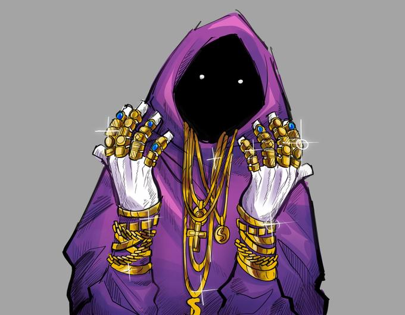 | SWMG wizard: void-black hood face, two tiny white eye glints, white gloves flashing signs, heavy gold jewelry, purple robe | Know Your Meme SWMG entry (meme art) — https://knowyourmeme.com/sensitive/memes/shadow-wizard-money-gang | SWMG | **Narrator reference** — front-facing character-select composition |
| 3 | 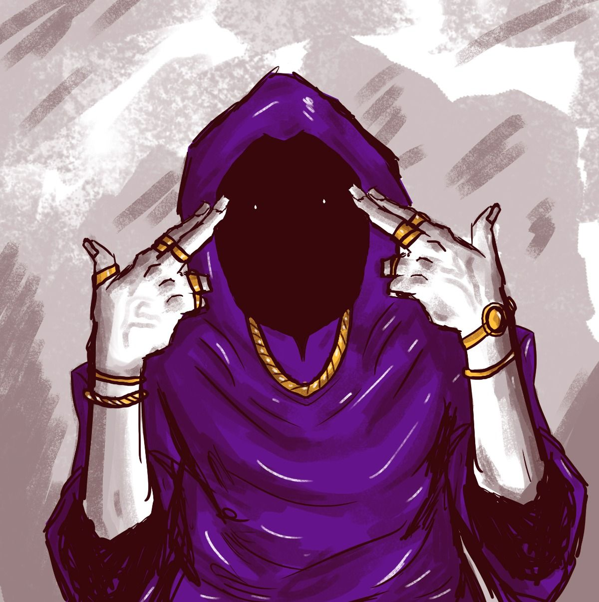 | Purple-hooded wizard, void-black face w/ glints, white gloves pointing at viewer, single gold chain | Pinterest pin (original artist unknown) — https://au.pinterest.com/pin/shadow-wizard-money-gang--37717715625812673/ | SWMG | Narrator reference — direct-address pose |
| 4 | 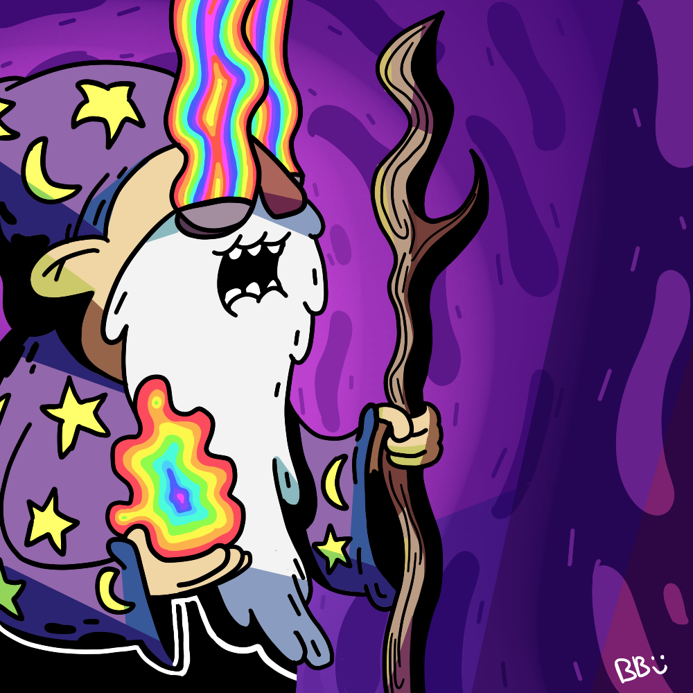 | Cartoon "trippy wizard": rainbow drip from hat, star/moon motifs on purple robe | brandonpewpew, Newgrounds — https://www.newgrounds.com/art/view/brandonpewpew/trippy-wizard | Wizardposting | Meme literacy only — too cartoony for our direction |
| 5 | 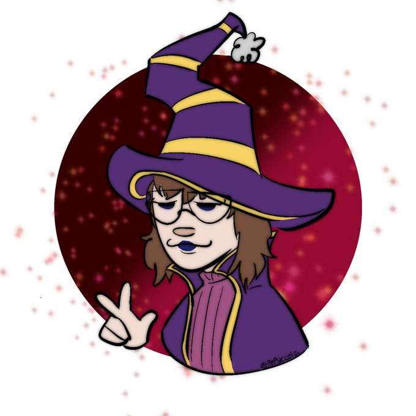 | Chibi cartoon wizard: purple/gold hat and robes, peace sign, red sparkle bg | Twitter artist via buhitter — https://buhitter.com/author/pepskcola | Wizardposting | Meme literacy only — cartoon variant, not our direction |
| 6 | 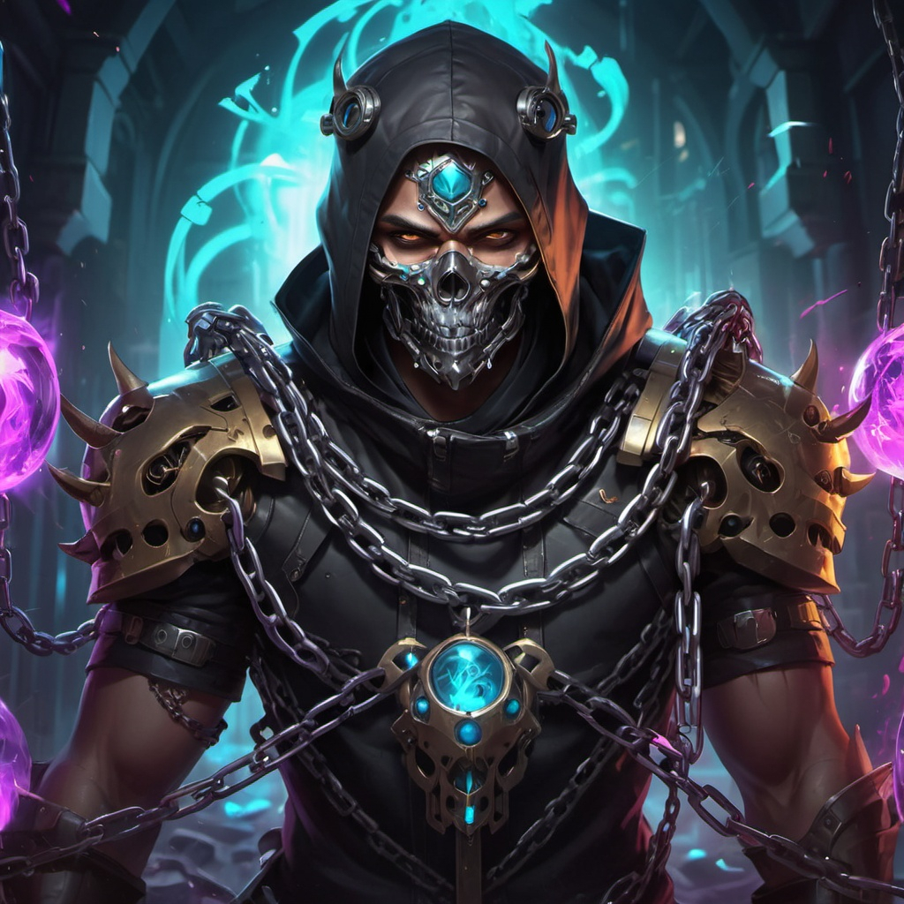 | Dark armored figure, black hood, skull mask, heavy chains across chest, glowing cyan/purple arcane sigils | OpenArt community contributor — https://openart.ai/community/WEvoXpjpBzQYozyDxoA6 | Malakor | Hollows/underworld mood — chain + sigil motifs for props/murals |
| 7 | 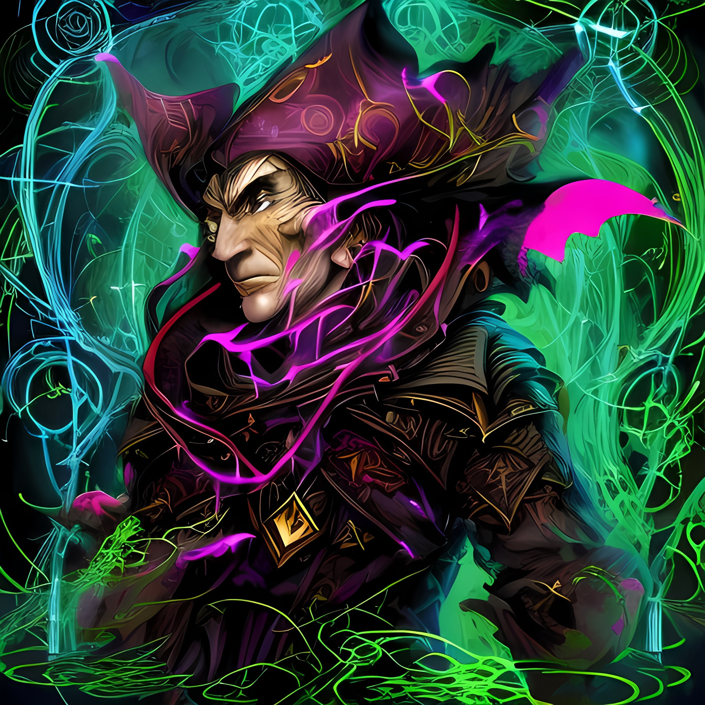 | Purple-hat wizard w/ gold trim, purple/green energy tendrils, early-3D-render look | OpenArt community contributor — https://openart.ai/community/Y6ZVj4b69tJ6trxOtEsL | Malakor | The 90s-CGI render vibe owner identified in Malakor's clips |
| 8 | 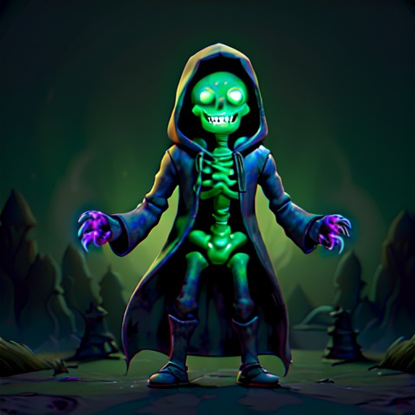 | Glowing green skeleton in dark hooded robe, purple flame hands, dark cemetery, 3D render | OpenArt community contributor — https://openart.ai/community/lhv2thaJ8B1ZoOe4iO0I | Malakor/SWMG | Malakor-style mashup mood; imposing-silhouette reference |
| 9 | 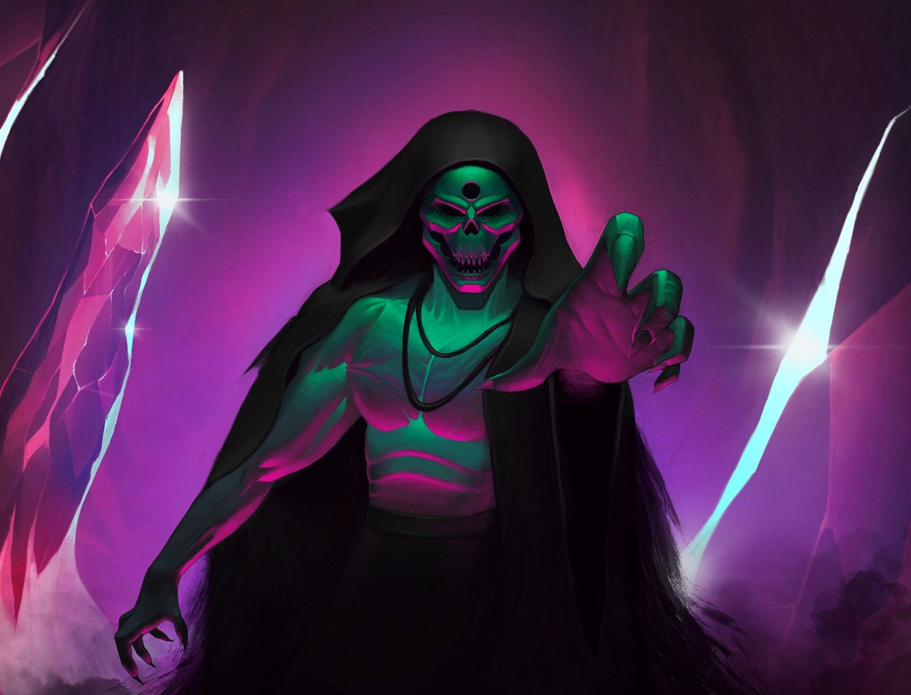 | Purple neon skeleton in black hood reaching toward viewer, lightning, dark street | wallpaperaccess.com (uploader unknown) — https://wallpaperaccess.com/neon-god | Malakor | Menu backdrop / Hollows atmosphere reference |
| 10 | 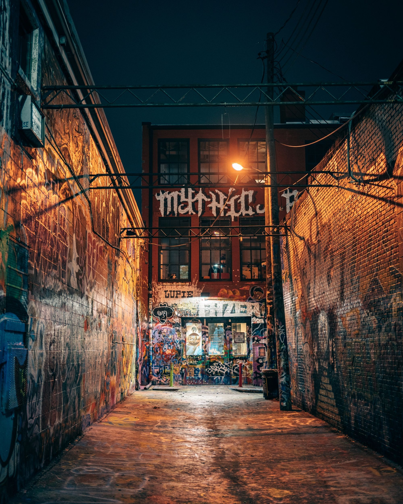 | Night alley: graffiti-covered brick walls, wet pavement, string lights, single lamp | Pinterest/pinvibe, Baltimore street art — https://www.pinterest.co.uk/ideas/baltimore-street-art/911167988426/ | Street base | Grounded urban canvas the SWMG layer sits on — where spellbook graffiti would live |
| 11 | 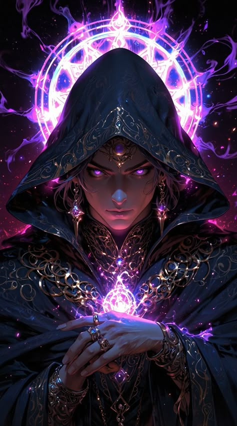 | Hooded sorceress, glowing purple eyes, spell circle halo, gold filigree — high fantasy | Pinterest/pinvibe (artist unknown) — https://www.pinvibe.com/media/361625045097433347 | Malakor | ⚠️ Too fantasy-literal for the Narrator; spell-circle motif useful for Malakor murals only |
| 12 | 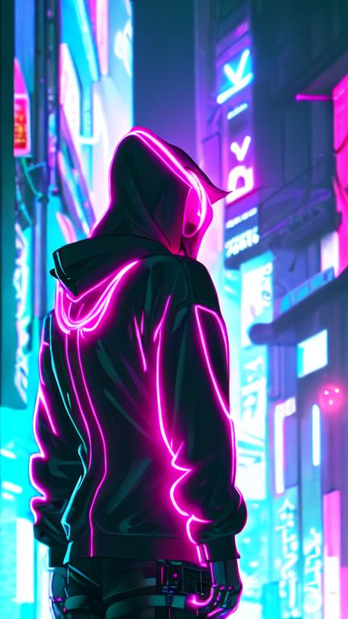 | Rear-view hoodie figure w/ pink neon edge-light in neon city — full cyberpunk | OpenArt community contributor — https://openart.ai/community/lRmk5TYK0dNywec3FM0B | — | ⚠️ **Negative example**: neon-everything is banned for default menus (owner). Neon District only |

### License / credit summary
- All images are **reference/analysis only** — none ship in the game.
- Sources: Know Your Meme, Pinterest/pinvibe pins, Newgrounds artist,
  Twitter artist, PromptHero prompt contributor, OpenArt community renders,
  wallpaperaccess.com uploader.
- Where the original artist is identifiable (brandonpewpew, jarlungus-era
  meme art via KYM), credit is given. Several are community-upload reposts
  with unknown original artists — flagged above. If any ref graduates toward
  production use, re-clear the source first.

---

## 4. Open questions for the owner
- The Narrator's canon design (purple robe, void-black face, sparkly eye
  glints, diamond-grill smile, blonde braids, gold chains) maps 1:1 onto the
  SWMG visual language — refs 1–3 are ready references. Confirm whether the
  Narrator should appear in menu art directly or only in-game.
- Ref 12 is the cyberpunk line-not-to-cross; confirm Neon District is the
  only place neon-heavy hooded-figure art may appear.
