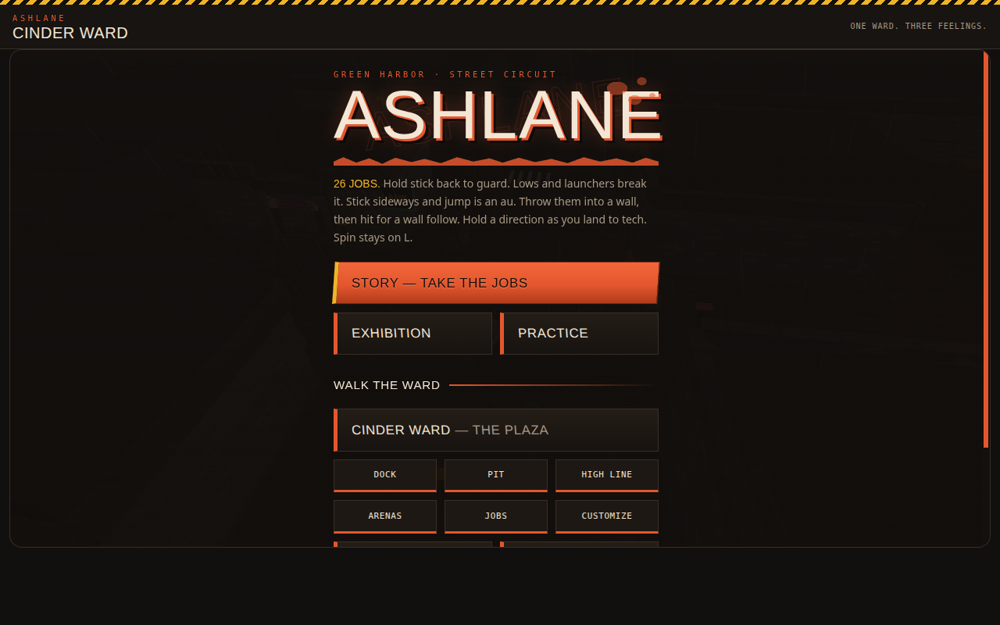
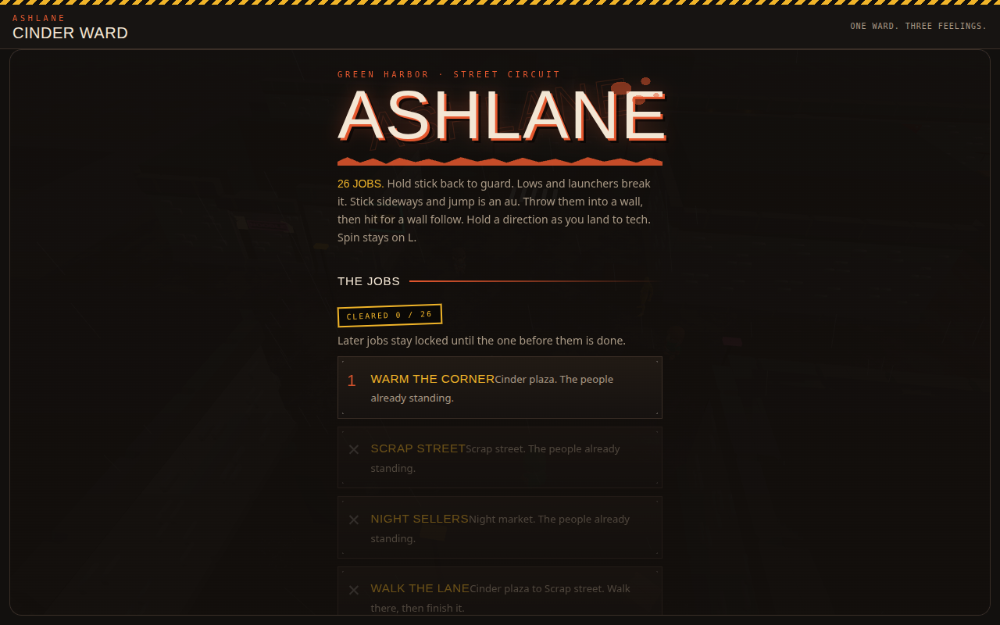
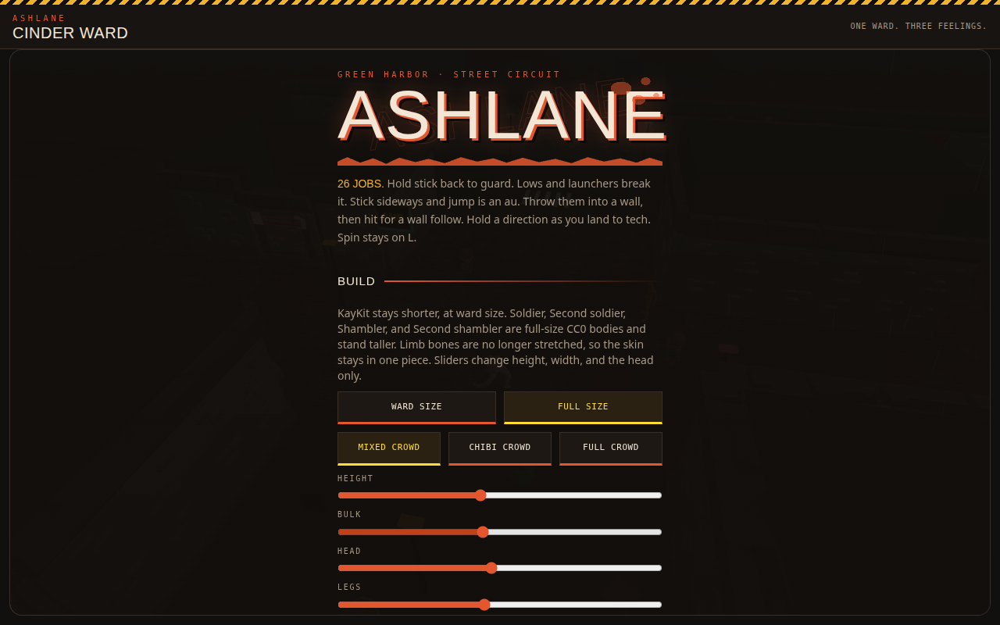
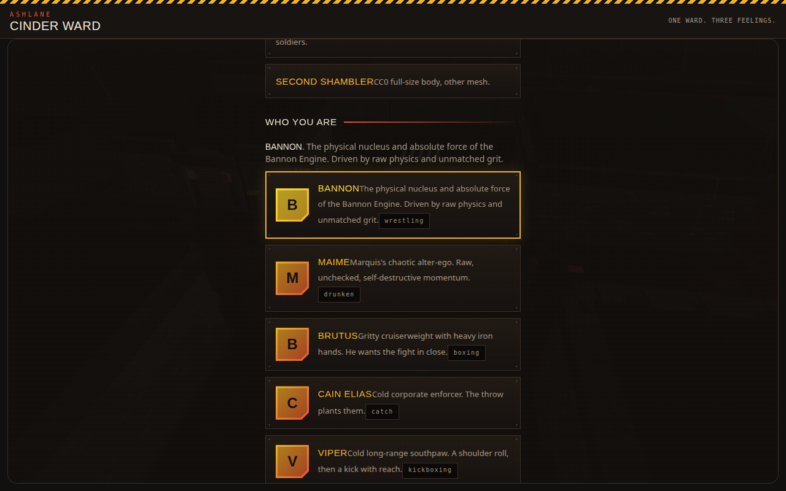
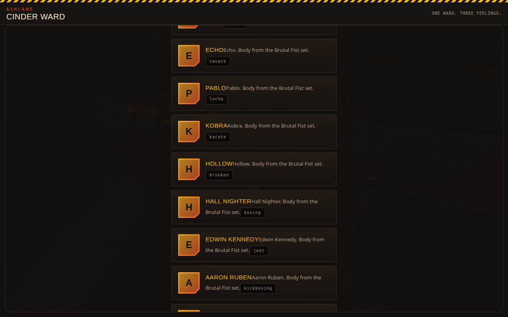
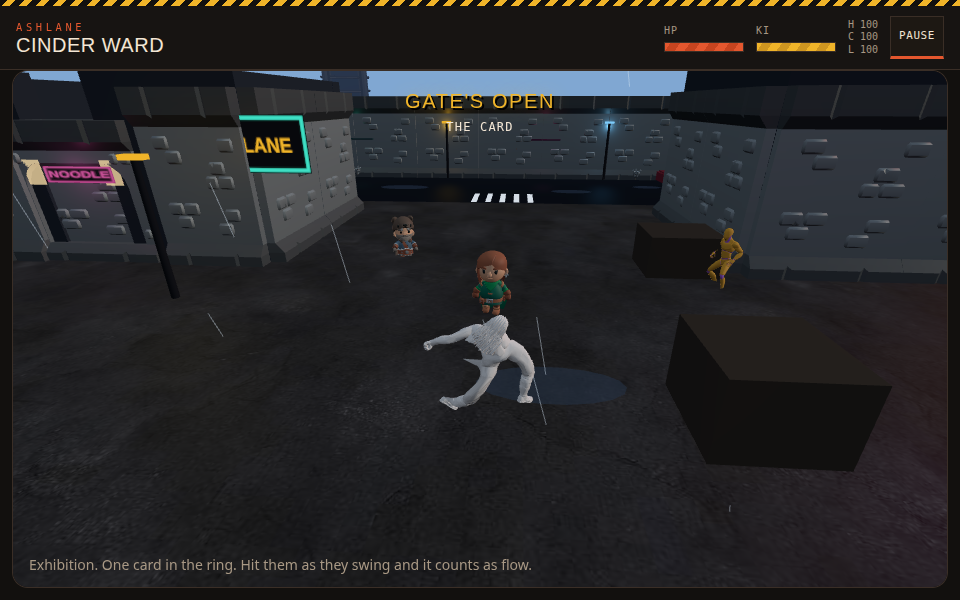
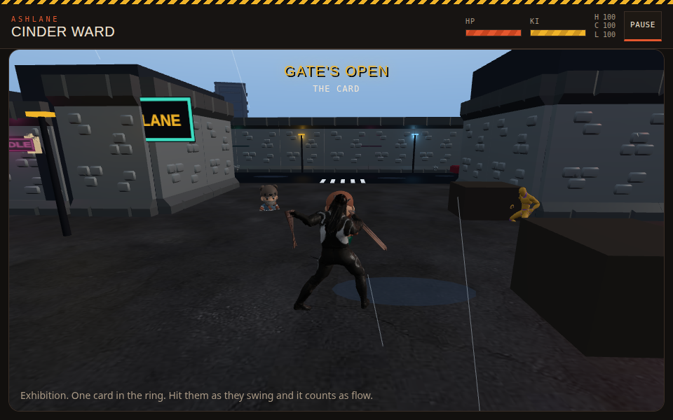
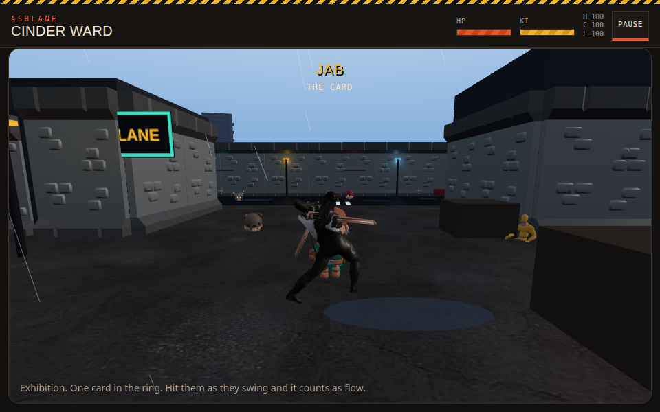
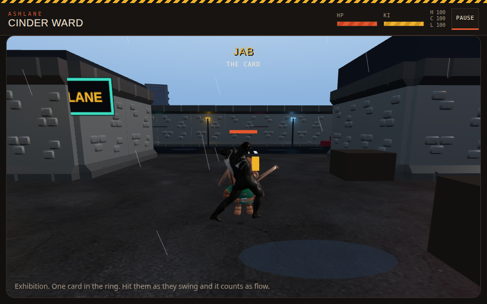

# AshLane PWA Proof — 2026-10-05

**Real screenshots from a headless Chromium playthrough.** No mocks, no claims without pixels.

## What was tested

Built from `main` (commit `437dd7b`), served via Vite dev, driven with Playwright:
- Main menu → Story/Jobs → Customize → Arenas → Exhibition combat
- Selected HOLLOW as fighter, fought with J (attack), W (move), K (grab), L (blast)

## Screenshots

### 01 — Main menu (Concrete Jungle theme)

The theme renders. ASHLANE title, STORY / EXHIBITION / PRACTICE, WALK THE WARD with arena chips.

### 02 — Story / Jobs

26 jobs, locked/unlocked progression, "CLEARED 0 / 26" stamp. Mission 1 "WARM THE CORNER" unlocked, rest locked.

### 03 — Customize (body)

WARD SIZE vs FULL SIZE, crowd type (MIXED/CHIBI/FULL), HEIGHT/BULK/HEAD/LEGS sliders. All render and are interactive.

### 04 — Roster (A)

BANNON (wrestling), MAIME (drunken), BRUTUS (boxing), CAIN ELIAS (catch), VIPER (kickboxing). Monogram portraits, bios, style chips.

### 05 — Roster (B)

ECHO (savate), PABLO (lucha), KOBRA (karate), HOLLOW (drunken), HALL NIGHTER (boxing), EDWIN KENNEDY (jeet), AARON RUBEN (kickboxing). All "Body from the Brutal Fist set."

### 06 — Combat (default Bannon)

3D street arena renders: buildings, LANE/NOODLE neon, rain, crates, HP/KI bars, H/C/L regional damage (100/100/100), PAUSE. Two chibi opponents + one gold fighter. **BUG: player character renders WHITE/UNtextured** — `THREE.GLTFLoader: Couldn't load texture` on BANNON_muscular_skinned.glb's embedded texture.

### 07 — Hollow (textured, fighting stance)

Selecting HOLLOW gives a proper textured character: black bodysuit, long hair, combat stance. Character switching works.

### 08 — Jab landing

Pressed J → "JAB" move name displays, Hollow's arm extends, opponent in range. Animation plays, not T-pose.

### 09 — Damage confirmed

Enemy HP bar (red) and stun bar (yellow) appear above the opponent. Combat system works: input → animation → hit → damage.

## Verdict

| System | Status |
|--------|--------|
| Main menu (Concrete Jungle) | ✅ Renders, all buttons work |
| Story/Jobs (26 missions) | ✅ Renders, lock/unlock logic works |
| Customize (body/crowd sliders) | ✅ Renders, interactive |
| Roster (15+ fighters) | ✅ Renders, selection works |
| 3D combat arena | ✅ Renders (street, rain, neon, props) |
| Character animations | ✅ Play (jab, stance, walk) |
| Damage/HP system | ✅ Works (enemy bars appear) |
| Music (procedural Web Audio) | ✅ Wired (starts on bout, hype/tense), AudioContext running |
| Bannon default texture | ❌ BROKEN — renders white, texture fails to load |

## Bugs found

1. **CRITICAL (build):** `src/styles.css` imported `../game3d/menu-theme.css` (wrong path) — build failed on main. **FIXED** in commit `437dd7b` (`./game3d/menu-theme.css`).
2. **Bannon texture:** `BANNON_muscular_skinned.glb` has 1 embedded texture that fails to load (`THREE.GLTFLoader: Couldn't load texture blob:`). Character renders solid white. Hollow and others render fine. Needs investigation — possibly corrupt texture encoding in the GLB.
3. **2x `ERR_EMPTY_RESPONSE`** on resource loads during bout start — likely the failed texture retries.

## Inspiration comparison (from research)

**Yakuza 0:** Boots to an opening cinematic → title screen → Start → New Game/Load/Options. The menu is minimal — the game wants you IN the story fast. AshLane's menu is busier (more options upfront) but that's fine for a PWA — no install, no cinematic, get to the fight.

**Urban Reign:** Main menu → Story (100 missions, map select) / Versus / Options. Missions are picked from a list, each is one fast fight, dying = instant retry. AshLane's 26-job structure matches this well — the "never wastes your time" pacing is the right model.

**Def Jam FFNY:** Menu → Create-a-fighter (deep) → Story. The character creation is the hook. AshLane's Customize (body sliders + roster + styles + stances + move lab) is heading in this direction but the monogram portraits need to become real renders.

**What AshLane should steal:**
- Yakuza: Get to gameplay FASTER. The current menu has 6+ buttons before you fight. A "QUICK FIGHT" button on the main menu would help.
- Urban Reign: The mission list IS the game. AshLane has this right — keep missions fast, retry instant.
- Def Jam: Character creation as identity. The roster bios are good; real portrait renders would sell it.

## What's missing (not yet in PWA)

- The `jobs` screen (noted in earlier docs as missing)
- UAL1/UAL2 animation loading in view.ts (still uses older animation-library path)
- Real portrait renders (currently monogram letters)
- The 12 newly-ported federated modules (weather, dialogue, quests, etc.) are not yet wired into sim.ts/view.ts
- Urban Mayhem's 24 disciplines are ported but not yet connected to char-gen
