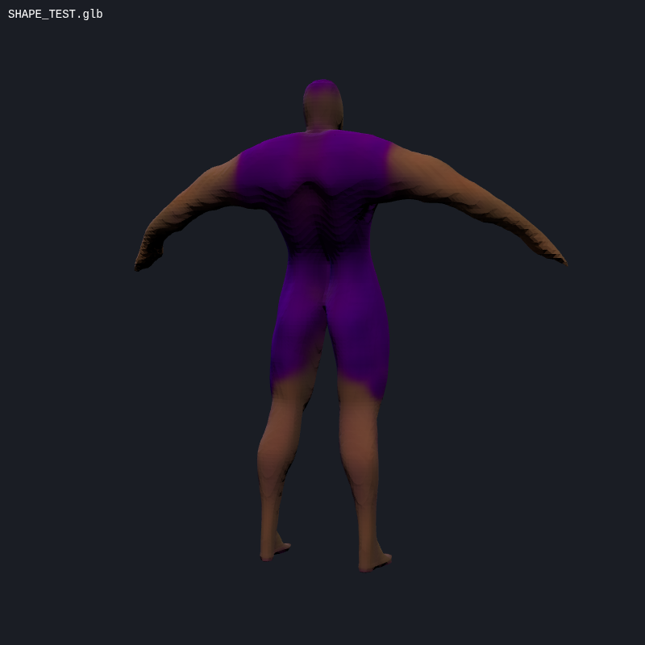

# Automated GPU Character Generation

**Zero manual steps.** Text prompt in, game-ready GLB out. No browser clicks, no Colab, no homework.

## How It Works

```
Text/Image → HF Space (free GPU) → GLB download → Postprocess → Game pipeline
```

## Quick Start

```bash
# Single character from text
python auto-character.py --prompt "muscular wrestler in purple tights" --name vato

# Single character from reference image
python auto-character.py --image ref.png --name cyborg

# Batch mode (unattended)
python auto-character.py --batch batch-example.json --output ./output/
```

## Backends (tried in order)

| Backend | Quality | Speed | Status |
|---------|---------|-------|--------|
| **Shap-E** (`hysts/Shap-E`) | Medium (blobby but real) | ~2 min | ✅ WORKING |
| **TRELLIS** (`trellis-community/TRELLIS`) | High | ~5 min | ⚠️ API unstable |
| **Stable Fast 3D** (`stabilityai/stable-fast-3d`) | High | ~3 min | ⚠️ API errors |

**Proof:** `proof-shap-e-wrestler.glb` — generated from "a muscular wrestler in purple tights" via Shap-E, fully automated.



## Batch Format

```json
[
  {
    "name": "vato",
    "prompt": "muscular luchador, purple tights with gold trim",
    "seed": 42
  },
  {
    "name": "cyborg",
    "image": "refs/cyborg.png",
    "seed": 123
  }
]
```

## Self-Hosted GPU (Fallback)

If free Spaces are down or rate-limited:

```bash
# Deploy to RunPod ($0.34/hr) or Vast.ai ($0.25/hr)
./deploy-gpu.sh runpod
```

See `Dockerfile` and `server.py` for the self-hosted TripoSR server.

## License

All backends use MIT-licensed models:
- Shap-E: MIT (OpenAI)
- TRELLIS: MIT
- TripoSR: MIT (Stability AI)
- Stable Fast 3D: Check license (Stability AI)
